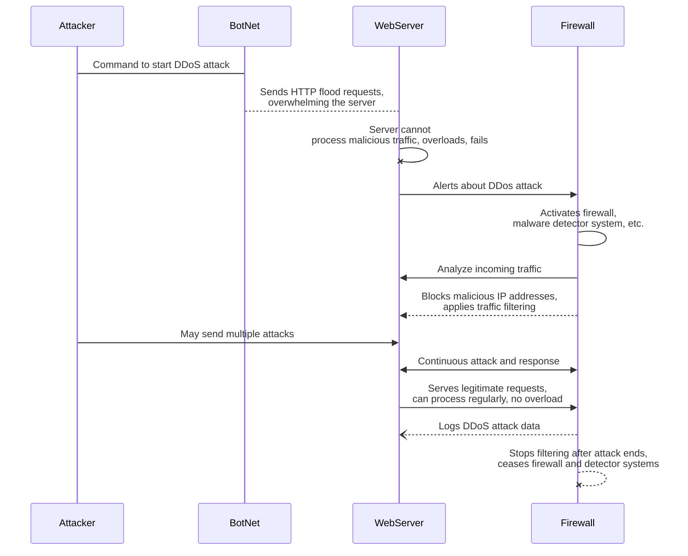

# DDoS Attack Scenario

## Process
1. The attacker controls compromised bots in the Botnet and remotely commands them to send malicious requests of traffic to the WebServer, with the intention of overwhelming the server.
2. The bots then send floods of requests numerous enough to exhaust the server's resources, causing the server to slow down and/or crash.
3. When the web server slows down due to requests consuming its network bandwidth, it becomes unable to respond to legitimate user requests, which causes website downtime or server downtime.
4. Monitoring or detection systems identify abnormal traffic behavior and send alert logs to network defense mechanisms such as the firewall or other malware detection features, effectively activating these protocols.
5. Once the firewall is alerted, it begins to process user requests, analyzing volume of requests, patterns, common IP addresses, connection security, packet rates, destination ports, and overall legitimacy to distinguish malicious requests from legitimate ones.  
   In some cases, the firewall uses **IP spoofing, rate limiting, geo-blocking**, and monitoring systems to block and filter traffic.
6. Throughout this period of time, the attacker may decide to send multiple commands to distribute multiple attacks on a server, also known as _"multi-vector attacks"_. This may involve, for instance, sending various different forms of requests: UDP floods, SYN floods, and HTTP floods.
7. The server and firewall continuously communicate to share and distribute protection filters on malicious requests.
8. After the attack(s) is fully addressed and the server resumes standard behavior, the firewall logs DDoS attack data and terminates.
